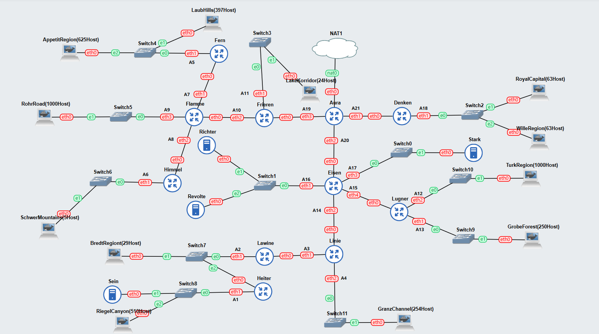
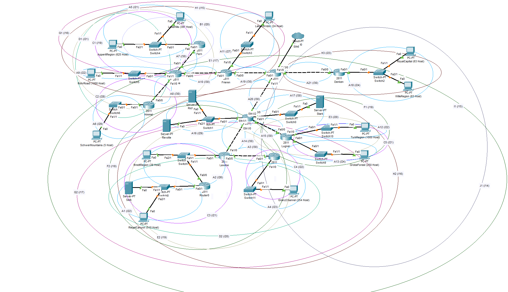
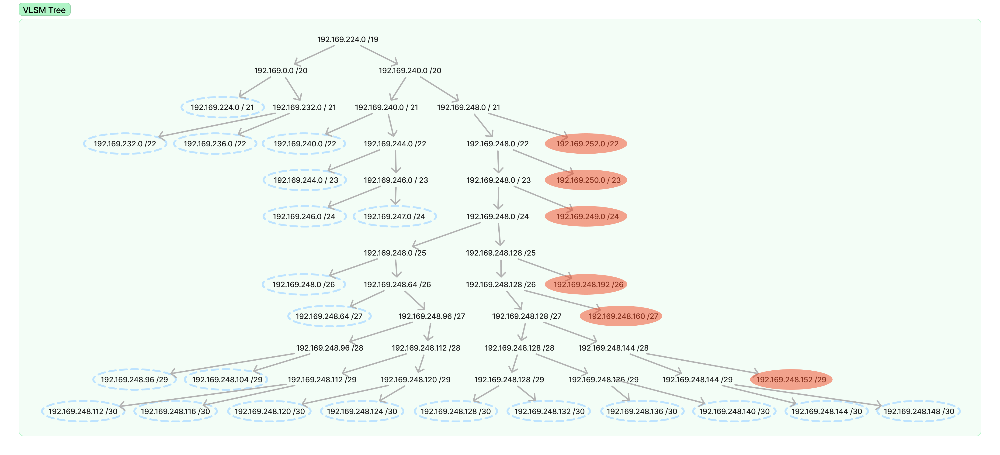
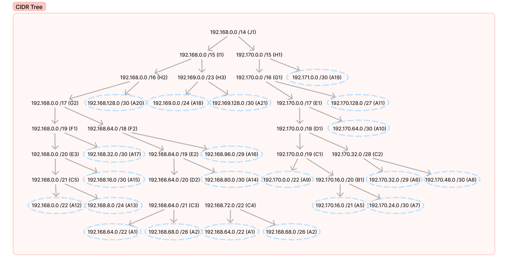

<div align=center>

# Dokumentasi Jarkom Praktikum 4

| Nama | Muhammad Ersya Vinorian |
| :--- | :---------------------- |
| NRP  | 5025211045              |

</div>

## Topologi

### GNS - VLSM



### CPT - CIDR



## Pembagian Subnet

| Nama Subnet | Rute                                    | Jumlah IP | Netmask |
| :---------: | :-------------------------------------- | --------: | :------ |
|     A1      | Heiter-Switch8-Sein-RiegelCanyon        |       512 | /22     |
|     A2      | Lawine-Switch7-Heiter-BredtRegion       |        31 | /26     |
|     A3      | Linie-Lawine                            |         2 | /30     |
|     A4      | Linie-Switch11-GranzChannel             |       255 | /23     |
|     A5      | Fern-Swithc4-LaubHils-AppetitRegion     |      1023 | /21     |
|     A6      | Himmel-Switch6-SchwerMountains          |         6 | /29     |
|     A7      | Flamme-Fern                             |         2 | /30     |
|     A8      | Flamme-Himmel                           |         2 | /30     |
|     A9      | Flamme-Switch5-RohrRoad                 |      1001 | /22     |
|     A10     | Frieren-Flamme                          |         2 | /30     |
|     A11     | Frieren-Switch3-LakeKorridor            |        25 | /27     |
|     A12     | Lugner-Switch10-TurkRegion              |      1001 | /22     |
|     A13     | Lugner-Switch9-GrobeForest              |       251 | /24     |
|     A14     | Eisen-Linie                             |         2 | /30     |
|     A15     | Eisen-Lugner                            |         2 | /30     |
|     A16     | Eisen-Switch1-Richter-Revolte           |         3 | /29     |
|     A17     | Eisen-Switch0-Stark                     |         2 | /30     |
|     A18     | Denken-Switch2-RoyalCapital-WilleRegion |       127 | /24     |
|     A19     | Aura-Frieren                            |         2 | /30     |
|     A20     | Aura-Eisen                              |         2 | /30     |
|     A21     | Aura-Denken                             |         2 | /30     |
|             | Total                                   |      4255 | /19     |

## VLSM

Untuk memetakan IP subnet menggunakan _Variable Length Subnet Masking_ akan dilakukan pemecahan IP dari netmask paling besar (/19) hingga sesuai dengan jumlah netmask yang dibutuhkan.

### Jumlah netmask yang diperlukan

| Netmask | Total |
| ------- | ----: |
| /20     |     0 |
| /21     |     1 |
| /22     |     3 |
| /23     |     1 |
| /24     |     2 |
| /25     |     0 |
| /26     |     1 |
| /27     |     1 |
| /28     |     0 |
| /29     |     2 |
| /30     |    10 |
| Total   |    21 |

Setelah menentukan kebutuhan masing masing netmask, akan dilakukan pembagian IP menggunakan tree seperti berikut.

### Tree



IP dan subnet yang dilingkari biru merupakan NID yang dipilih dari kebutuhan netmask yang telah dihitung.

### Pembagian IP

| Subnet | Network ID        | Netmask           | Broadcast         |
| :----: | :---------------- | :---------------- | :---------------- |
|   A1   | `192.169.232.0`   | `255.255.252.0`   | `192.169.235.255` |
|   A2   | `192.169.248.0`   | `255.255.255.192` | `192.169.248.63`  |
|   A3   | `192.169.248.112` | `255.255.255.252` | `192.169.248.115` |
|   A4   | `192.169.244.0`   | `255.255.254.0`   | `192.169.245.255` |
|   A5   | `192.169.224.0`   | `255.255.248.0`   | `192.169.231.255` |
|   A6   | `192.169.248.96`  | `255.255.255.248` | `192.169.248.103` |
|   A7   | `192.169.248.116` | `255.255.255.252` | `192.169.248.119` |
|   A8   | `192.169.248.120` | `255.255.255.252` | `192.169.248.123` |
|   A9   | `192.169.236.0`   | `255.255.252.0`   | `192.169.239.255` |
|  A10   | `192.169.248.124` | `255.255.255.252` | `192.169.248.127` |
|  A11   | `192.169.248.64`  | `255.255.255.224` | `192.169.248.95`  |
|  A12   | `192.169.240.0`   | `255.255.252.0`   | `192.169.243.255` |
|  A13   | `192.169.246.0`   | `255.255.255.0`   | `192.169.246.255` |
|  A14   | `192.169.248.128` | `255.255.255.252` | `192.169.248.131` |
|  A15   | `192.169.248.132` | `255.255.255.252` | `192.169.248.135` |
|  A16   | `192.169.248.104` | `255.255.255.248` | `192.169.248.111` |
|  A17   | `192.169.248.136` | `255.255.255.252` | `192.169.248.139` |
|  A18   | `192.169.247.0`   | `255.255.255.0`   | `192.169.247.255` |
|  A19   | `192.169.248.140` | `255.255.255.252` | `192.169.248.143` |
|  A20   | `192.169.248.144` | `255.255.255.252` | `192.169.248.147` |
|  A21   | `192.169.248.148` | `255.255.255.252` | `192.169.248.151` |

Setelah mendapatkan persebaran IP tersebut, maka akan dilakukan konfigurasi alamat pada GNS3 dan juga routing.

### Konfigurasi Network dan Routing

#### Aura

```sh
# from NAT
auto eth0
iface eth0 inet dhcp

# to A21
auto eth1
iface eth1 inet static
address 192.169.248.149
netmask 255.255.255.252

# to A20
auto eth2
iface eth2 inet static
address 192.169.248.145
netmask 255.255.255.252

# to A19
auto eth3
iface eth3 inet static
address 192.169.248.141
netmask 255.255.255.252

# via A21
up route add -net 192.169.247.0   netmask 255.255.255.0   gw 192.169.248.150 # A18

# via A19
up route add -net 192.169.248.64  netmask 255.255.255.224 gw 192.169.248.142 # A11
up route add -net 192.169.248.124 netmask 255.255.255.252 gw 192.169.248.142 # A10

up route add -net 192.169.236.0   netmask 255.255.252.0   gw 192.169.248.142 # A9
up route add -net 192.169.248.120 netmask 255.255.255.252 gw 192.169.248.142 # A8
up route add -net 192.169.248.116 netmask 255.255.255.252 gw 192.169.248.142 # A7

up route add -net 192.169.248.96  netmask 255.255.255.248 gw 192.169.248.142 # A6
up route add -net 192.169.224.0   netmask 255.255.248.0   gw 192.169.248.142 # A5

# via A20
up route add -net 192.169.248.104 netmask 255.255.255.248 gw 192.169.248.146 # A16
up route add -net 192.169.248.128 netmask 255.255.255.252 gw 192.169.248.146 # A14
up route add -net 192.169.248.132 netmask 255.255.255.252 gw 192.169.248.146 # A15
up route add -net 192.169.248.136 netmask 255.255.255.252 gw 192.169.248.146 # A17

up route add -net 192.169.246.0   netmask 255.255.255.0   gw 192.169.248.146 # A13
up route add -net 192.169.240.0   netmask 255.255.252.0   gw 192.169.248.146 # A12

up route add -net 192.169.248.112 netmask 255.255.255.252 gw 192.169.248.146 # A3
up route add -net 192.169.244.0   netmask 255.255.254.0   gw 192.169.248.146 # A4

up route add -net 192.169.248.0   netmask 255.255.255.192 gw 192.169.248.146 # A2
up route add -net 192.169.232.0   netmask 255.255.252.0   gw 192.169.248.146 # A2
```

#### Denken

```sh
# from A21
auto eth0
iface eth0 inet static
address 192.169.248.150
netmask 255.255.255.252
gateway 192.169.248.149

# to A18
auto eth1
iface eth1 inet static
address 192.169.247.1
netmask 255.255.255.0
```

#### RoyalCapital (63 Host)

```sh
# from A18
auto eth0
iface eth0 inet static
address 192.169.247.2
netmask 255.255.255.0
gateway 192.169.247.1
```

#### WilleRegion (63 Host)

```sh
# from A18
auto eth0
iface eth0 inet static
address 192.169.247.3
netmask 255.255.255.0
gateway 192.169.247.1
```

#### Frieren

```sh
# from A19
auto eth0
iface eth0 inet static
address 192.169.248.142
netmask 255.255.255.252
gateway 192.169.248.141

# to A11
auto eth1
iface eth1 inet static
address 192.169.248.65
netmask 255.255.255.224

# to A10
auto eth2
iface eth2 inet static
address 192.169.248.125
netmask 255.255.255.252

# via A10
up route add -net 192.169.236.0   netmask 255.255.252.0   gw 192.169.248.126 # A9
up route add -net 192.169.248.120 netmask 255.255.255.252 gw 192.169.248.126 # A8
up route add -net 192.169.248.116 netmask 255.255.255.252 gw 192.169.248.126 # A7
up route add -net 192.169.248.96  netmask 255.255.255.248 gw 192.169.248.126 # A6
up route add -net 192.169.224.0   netmask 255.255.248.0   gw 192.169.248.126 # A5
```

#### LakeKorridor (24 Host)

```sh
# from A11
auto eth0
iface eth0 inet static
address 192.169.248.66
netmask 255.255.255.224
gateway 192.169.248.65
```

#### Flamme

```sh
# from A10
auto eth0
iface eth0 inet static
address 192.169.248.126
netmask 255.255.255.252
gateway 192.169.248.125

# to A7
auto eth1
iface eth1 inet static
address 192.169.248.117
netmask 255.255.255.252

# to A8
auto eth2
iface eth2 inet static
address 192.169.248.121
netmask 255.255.255.252

# to A9
auto eth3
iface eth3 inet static
address 192.169.236.1
netmask 255.255.252.0

# via A7
up route add -net 192.169.224.0   netmask 255.255.248.0   gw 192.169.248.118 # A5

# via A8
up route add -net 192.169.248.96  netmask 255.255.255.248 gw 192.169.248.122 # A6
```

#### Fern

```sh
# from A7
auto eth0
iface eth0 inet static
address 192.169.248.118
netmask 255.255.255.252
gateway 192.169.248.117

# to A5
auto eth1
iface eth1 inet static
address 192.169.224.1
netmask 255.255.248.0
```

#### AppetitRegion (625 Host)

```sh
# from A5
auto eth0
iface eth0 inet static
address 192.169.224.3
netmask 255.255.248.0
gateway 192.169.224.1
```

#### LaubHills (397 Host)

```sh
# from A5
auto eth0
iface eth0 inet static
address 192.169.224.2
netmask 255.255.248.0
gateway 192.169.224.1
```

#### Himmel

```sh
# from A8
auto eth0
iface eth0 inet static
address 192.169.248.122
netmask 255.255.255.252
gateway 192.169.248.121

# to A6
auto eth1
iface eth1 inet static
address 192.169.248.97
netmask 255.255.255.248
```

#### SchwerMountains (5 Host)

```sh
# from A6
auto eth0
iface eth0 inet static
address 192.169.248.98
netmask 255.255.255.248
gateway 192.169.248.97
```

#### RohrRoad (1000 Host)

```sh
# from A9
auto eth0
iface eth0 inet static
address 192.169.236.2
netmask 255.255.252.0
gateway 192.169.236.1
```

#### Eisen

```sh
# from A20
auto eth0
iface eth0 inet static
address 192.169.248.146
netmask 255.255.255.252
gateway 192.169.248.145

# to A16
auto eth1
iface eth1 inet static
address 192.169.248.105
netmask 255.255.255.248

# to A14
auto eth2
iface eth2 inet static
address 192.169.248.129
netmask 255.255.255.252

# to A17
auto eth3
iface eth3 inet static
address 192.169.248.137
netmask 255.255.255.252

# to A15
auto eth4
iface eth4 inet static
address 192.169.248.133
netmask 255.255.255.252

# via A15
up route add -net 192.169.246.0   netmask 255.255.255.0   gw 192.169.248.134 # A13
up route add -net 192.169.240.0   netmask 255.255.252.0   gw 192.169.248.134 # A12

# via A14
up route add -net 192.169.248.112 netmask 255.255.255.252 gw 192.169.248.130 # A3
up route add -net 192.169.244.0   netmask 255.255.254.0   gw 192.169.248.130 # A4

up route add -net 192.169.248.0   netmask 255.255.255.192 gw 192.169.248.130 # A2
up route add -net 192.169.232.0   netmask 255.255.252.0   gw 192.169.248.130 # A1
```

#### Stark

```sh
# from A17
auto eth0
iface eth0 inet static
address 192.169.248.138
netmask 255.255.255.252
gateway 192.169.248.137
```

#### Lugner

```sh
# from A15
auto eth0
iface eth0 inet static
address 192.169.248.134
netmask 255.255.255.252
gateway 192.169.248.133

# to A13
auto eth1
iface eth1 inet static
address 192.169.246.1
netmask 255.255.255.0

# to A12
auto eth2
iface eth2 inet static
address 192.169.240.1
netmask 255.255.252.0
```

#### TurkRegion (1000 Host)

```sh
# from A12
auto eth0
iface eth0 inet static
address 192.169.240.2
netmask 255.255.252.0
gateway 192.169.240.1
```

#### GrobeForest (250 Host)

```sh
# from A13
auto eth0
iface eth0 inet static
address 192.169.246.2
netmask 255.255.255.0
gateway 192.169.246.1
```

#### Richter

```sh
# from A16
auto eth0
iface eth0 inet static
address 192.169.248.106
netmask 255.255.255.248
gateway 192.169.248.105
```

#### Revolte

```sh
# from A16
auto eth0
iface eth0 inet static
address 192.169.248.107
netmask 255.255.255.248
gateway 192.169.248.105
```

#### Linie

```sh
# from A14
auto eth0
iface eth0 inet static
address 192.169.248.130
netmask 255.255.255.252
gateway 192.169.248.129

# to A3
auto eth1
iface eth1 inet static
address 192.169.248.113
netmask 255.255.255.252

# to A4
auto eth2
iface eth2 inet static
address 192.169.244.1
netmask 255.255.254.0

# via A3
up route add -net 192.169.248.0   netmask 255.255.255.192 gw 192.169.248.114 # A2
up route add -net 192.169.232.0   netmask 255.255.252.0   gw 192.169.248.114 # A1
```

#### GranzChannel (254 Host)

```sh
# from A4
auto eth0
iface eth0 inet static
address 192.169.244.2
netmask 255.255.254.0
gateway 192.169.244.1
```

#### Lawine

```sh
# from A3
auto eth0
iface eth0 inet static
address 192.169.248.114
netmask 255.255.255.252
gateway 192.169.248.113

# to A2
auto eth1
iface eth1 inet static
address 192.169.248.1
netmask 255.255.255.192

# via A2
up route add -net 192.169.232.0   netmask 255.255.252.0   gw 192.169.248.2 # A1
```

#### BredtRegiont (29 Host)

```sh
# from A2
auto eth0
iface eth0 inet static
address 192.169.248.3
netmask 255.255.255.192
gateway 192.169.248.1
```

#### Heiter

```sh
# from A2
auto eth0
iface eth0 inet static
address 192.169.248.2
netmask 255.255.255.192
gateway 192.169.248.1

# to A1
auto eth1
iface eth1 inet static
address 192.169.232.1
netmask 255.255.252.0
```

#### Sein

```sh
# from A1
auto eth0
iface eth0 inet static
address 192.169.232.3
netmask 255.255.252.0
gateway 192.169.232.1
```

#### RiegelCanyon (510 Host)

```sh
# from A1
auto eth0
iface eth0 inet static
address 192.169.232.2
netmask 255.255.252.0
gateway 192.169.232.1
```

## CIDR

Untuk memetakan IP subnet menggunakan _Classless Inter-Domain Routing_ akan dilakukan penggabungan dari dua kumpulan subnet yang terdekat.

### Tree



IP dan subnet yang dilingkari biru merupakan NID yang dipilih dari kebutuhan netmask yang telah dihitung.

### Penggabungan Subnet

#### Penggabungan I

| Subnet | Subnet1 | Netmask1 | Subnet2 | Netmask2 | Netmask Akhir |
| :----: | :-----: | :------: | :-----: | :------: | :-----------: |
|   B1   |   A5    |   /21    |   A7    |   /30    |      /20      |

#### Penggabungan II

| Subnet | Subnet1 | Netmask1 | Subnet2 | Netmask2 | Netmask Akhir |
| :----: | :-----: | :------: | :-----: | :------: | :-----------: |
|   C1   |   A9    |   /22    |   B1    |   /20    |      /19      |
|   C2   |   A6    |   /29    |   A8    |   /30    |      /28      |
|   C3   |   A1    |   /22    |   A2    |   /26    |      /21      |
|   C4   |   A3    |   /30    |   A4    |   /23    |      /22      |
|   C5   |   A12   |   /22    |   A13   |   /24    |      /21      |

#### Penggabungan III

| Subnet | Subnet1 | Netmask1 | Subnet2 | Netmask2 | Netmask Akhir |
| :----: | :-----: | :------: | :-----: | :------: | :-----------: |
|   D1   |   C1    |   /19    |   C2    |   /28    |      /18      |
|   D2   |   C3    |   /21    |   C4    |   /22    |      /20      |

#### Penggabungan IV

| Subnet | Subnet1 | Netmask1 | Subnet2 | Netmask2 | Netmask Akhir |
| :----: | :-----: | :------: | :-----: | :------: | :-----------: |
|   E1   |   D1    |   /18    |   A10   |   /30    |      /17      |
|   E2   |   D2    |   /20    |   A14   |   /30    |      /19      |
|   E3   |   C5    |   /21    |   A15   |   /30    |      /20      |

#### Penggabungan V

| Subnet | Subnet1 | Netmask1 | Subnet2 | Netmask2 | Netmask Akhir |
| :----: | :-----: | :------: | :-----: | :------: | :-----------: |
|   F1   |   E3    |   /20    |   A17   |   /30    |      /19      |
|   F2   |   E2    |   /19    |   A16   |   /29    |      /18      |

#### Penggabungan VI

| Subnet | Subnet1 | Netmask1 | Subnet2 | Netmask2 | Netmask Akhir |
| :----: | :-----: | :------: | :-----: | :------: | :-----------: |
|   G1   |   E1    |   /17    |   A11   |   /27    |      /16      |
|   G2   |   F1    |   /19    |   F2    |   /18    |      /17      |

#### Penggabungan VII

| Subnet | Subnet1 | Netmask1 | Subnet2 | Netmask2 | Netmask Akhir |
| :----: | :-----: | :------: | :-----: | :------: | :-----------: |
|   H1   |   G1    |   /16    |   A19   |   /30    |      /15      |
|   H2   |   G2    |   /17    |   A20   |   /30    |      /16      |
|   H3   |   A18   |   /24    |   A21   |   /30    |      /23      |

#### Penggabungan VIII

| Subnet | Subnet1 | Netmask1 | Subnet2 | Netmask2 | Netmask Akhir |
| :----: | :-----: | :------: | :-----: | :------: | :-----------: |
|   I1   |   H2    |   /16    |   H3    |   /23    |      /15      |

#### Penggabungan IX

| Subnet | Subnet1 | Netmask1 | Subnet2 | Netmask2 | Netmask Akhir |
| :----: | :-----: | :------: | :-----: | :------: | :-----------: |
|   J1   |   I1    |   /15    |   H1    |   /15    |      /14      |

### Pembagian IP

| Subnet | Network ID    | Netmask         | Broadcast      |
| :----: | :------------ | :-------------- | :------------- |
|   A1   | 192.168.64.0  | 255.255.252.0   | 192.169.67.255 |
|   A2   | 192.168.68.0  | 255.255.255.192 | 192.169.68.63  |
|   A3   | 192.168.72.0  | 255.255.255.252 | 192.169.72.3   |
|   A4   | 192.168.76.0  | 255.255.254.0   | 192.169.77.255 |
|   A5   | 192.170.16.0  | 255.255.248.0   | 192.169.23.255 |
|   A6   | 192.170.32.0  | 255.255.255.248 | 192.169.32.7   |
|   A7   | 192.170.24.0  | 255.255.255.252 | 192.169.24.3   |
|   A8   | 192.170.48.0  | 255.255.255.252 | 192.169.48.3   |
|   A9   | 192.170.0.0   | 255.255.252.0   | 192.169.3.255  |
|  A10   | 192.170.64.0  | 255.255.255.252 | 192.169.64.3   |
|  A11   | 192.170.128.0 | 255.255.255.224 | 192.169.128.31 |
|  A12   | 192.168.0.0   | 255.255.252.0   | 192.169.3.255  |
|  A13   | 192.168.8.0   | 255.255.255.0   | 192.169.8.255  |
|  A14   | 192.168.80.0  | 255.255.255.252 | 192.169.80.3   |
|  A15   | 192.168.16.0  | 255.255.255.252 | 192.169.16.3   |
|  A16   | 192.168.96.0  | 255.255.255.248 | 192.169.96.7   |
|  A17   | 192.168.32.0  | 255.255.255.252 | 192.169.32.3   |
|  A18   | 192.169.0.0   | 255.255.255.0   | 192.169.0.255  |
|  A19   | 192.171.0.0   | 255.255.255.252 | 192.169.0.3    |
|  A20   | 192.168.128.0 | 255.255.255.252 | 192.169.128.3  |
|  A21   | 192.169.128.0 | 255.255.255.252 | 192.169.128.3  |
